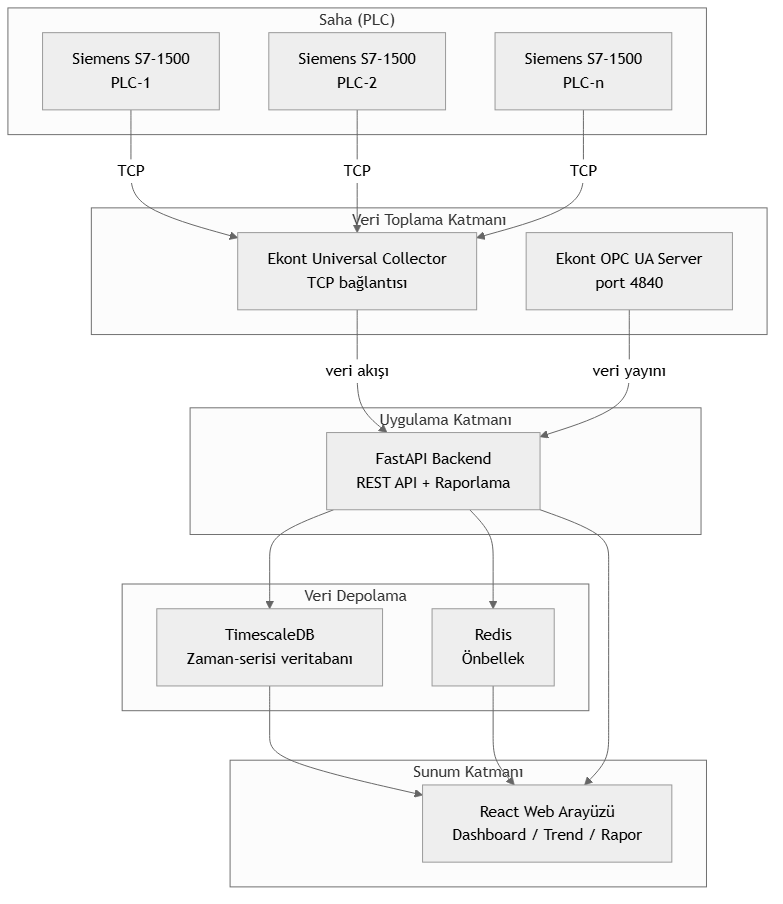

# Ekont Smart Scada Reporter

## Yapay Zeka Ajan Destekli Yeni Nesil Raporlama Sistemi

---

Ekont Smart Scada Reporter, **yapay zeka ajanları** tarafından doğrudan kullanılıp konfigüre edilebilen yeni nesil bir raporlama sistemidir. Siemens S7-1500 PLC'lerden Ekont Universal Collector ile toplanan endüstriyel veriyi, gelişmiş **MCP (Model Context Protocol)** desteği sayesinde yapay zeka ajanlarına anlamlı ve yapılandırılmış şekilde sunar. Kullanıcılar **web tarayıcısı üzerinden mobil, tablet ve masaüstü cihazlardan** sisteme erişebilir, yapay zeka ajanları ise MCP protokolü ile sisteme doğrudan bağlanarak veri sorgulama, analiz ve raporlama işlemlerini gerçekleştirebilir.

---

### Temel Özellikler

#### PLC Bağlantısı ve Veri Toplama
- Siemens S7-1500 PLC ailesine **Ekont Universal Collector** ile doğrudan TCP bağlantısı
- **3000+ etiket kataloğu** ile geniş veri noktası desteği
- **Ekont Smart Recording System**: değişmeyen verileri yazmaz, yalnızca belirlenen eşik değerini aşan değişimleri kaydeder. Örneğin bir seviye sensörü 0–100% aralığında %1'lik bir eşikle yapılandırıldığında, seviye sabitken hiç kayıt yapılmaz, yalnızca %1'den büyük her değişim anında kaydedilir. Bu sayede **veritabanı hacmi %95'e varan oranda azalır**, disk ve sorgu yükü minimuma iner
- Her etiket için **özelleştirilebilir eşik aralığı** (mutlak değer ve yüzdelik)
- **Çoklu PLC yönetimi**: her PLC için ayrı IP, rack ve slot yapılandırması
- **5 saniye aralıklı periyodik okuma** ile güncel veri
- PLC ulaşılamadığında **simülasyon modu** ile kesintisiz çalışma
- Dahili **Ekont OPC UA Server** (`opc.tcp://localhost:4840`) ile dış sistemlere veri yayını

#### Yapay Zeka Ajan Desteği ve MCP Protokolü
- **MCP (Model Context Protocol)** desteği ile yapay zeka ajanları sisteme doğrudan bağlanabilir
- AI ajanlar **veri sorgulama, analiz, rapor oluşturma ve sistem konfigürasyonu** yapabilir
- **Doğal dil ile veri sorgulama**: "Geçen hafta boyunca pompa-3 kaç kez devreye girmiş?" gibi sorulara REST API üzerinden anında yanıt (`POST /api/ai/query`)
- **AI anomali tespiti**: Z-score ve sıçrama analizi ile anormal değerler otomatik işaretlenir (`POST /api/ai/anomalies`)
- **Trend tahmini**: Lineer regresyon ile gelecek değer tahmini ve güven aralığı (`POST /api/ai/predict`)
- **AI rapor oluşturma**: Belirtilen etiketler, zaman aralığı ve toplulaştırma ile özet rapor üretimi (`POST /api/ai/reports/generate`)
- **Otomatik izleme ajanı**: `scada agent monitor` komutu ile periyodik sistem denetimi, anomali taraması ve gecikme kontrolü
- **MCP araçları (tools)** sayesinde ajanlar tag listesi, trend verisi, rapor şablonları ve sistem konfigürasyonuna doğrudan erişebilir
- Claude, ChatGPT, Gemini ve özel AI ajanlar ile tam uyumlu
- Ajanlar kullanıcı adına **periyodik raporları hazırlayıp dağıtabilir****

#### WinCC SCADA'dan Sorunsuz Tag Geçişi
- **WinCC'dan doğrudan tag listesi içe aktarma** — elle yeniden tanımlamaya gerek yok
- CSV, Excel ve WinCC dışa aktarma formatlarını otomatik tanıma
- **Veri tipi, adres ve birim eşleme** otomatik yapılır
- **Toplu tag içe/dışa aktarma** ile dakikalar içinde yüzlerce etiket taşıma
- Mevcut WinCC etiket adlarını koruyarak **sıfır kesinti ile geçiş**
- Geçiş sonrası tüm etiketleri web arayüzünden doğrulama ve düzenleme

#### Web Tabanlı Arayüz — Her Yerden Erişim
Modern React altyapısı ile geliştirilmiş **tamamen web tabanlı** kullanıcı arayüzü. Herhangi bir kurulum gerektirmez, yalnızca bir tarayıcı yeterlidir.

- **Mobil, tablet ve masaüstü** cihazlardan eksiksiz erişim — responsive tasarım, her ekrana uyumlu
- **Kurulum gerektirmez** — cihaza uygulama yüklemeye gerek yok, doğrudan tarayıcıdan açılır
- **VPN veya yerel ağ** üzerinden güvenli uzak erişim
- **HTTPS desteği** ile şifreli iletişim
- **PWA uyumlu** — mobil cihazda ana ekrana eklenerek uygulama gibi kullanılabilir

| Modül | Özellikler |
|-------|------------|
| **Dashboard** | Genel bakış sayıcıları, kişisel izleme listesi, tüm etiketlerde filtreli arama ve sayfalama |
| **Trend Analizi** | Çoklu etiket ve çoklu Y-ekseni, zoom/pan, sarı kesikli imleç, istatistiksel analiz (ortalama/trend çizgisi/min-max), periyot karşılaştırma, anotasyon desteği, PNG/Excel dışa aktarım, ön ayar yönetimi, zaman dilimi desteği |
| **Raporlar** | Etiket ve zaman aralığı seçimi, saatlik/günlük/haftalık/aylık toplulaştırma (min/max/avg/toplam/std sapma), Excel/PDF/JSON/CSV çıktı, filtre ön ayarları, koşullu rapor tetikleme |
| **Gelişmiş Raporlar** | Kullanıcı tanımlı şablonlar, zamanlayıcı ile periyodik otomatik rapor, e-posta dağıtımı, rapor arşivi, toplu indirme, kurumsal kimlik uyumlu başlık/logo/altbilgi |
| **Etiket Yönetimi** | Etiket listeleme, birim ve açıklama düzenleme, aktif/pasif durumu yönetimi |
| **PLC Yönetimi** | PLC ekleme/kaldırma, IP/rack/slot yapılandırması, bağlantı durumu izleme |
| **Ayarlar** | Dil seçimi, kullanıcı tercihleri (ör. trend grafik yüksekliği 300–2000 px) |
| **Kullanıcı Yönetimi** | Kullanıcı ekleme/düzenleme/silme, rol atama, mikro izin yapılandırması |

#### Zaman Serisi Veritabanı
- **PostgreSQL + TimescaleDB** ile optimize edilmiş zaman-serisi sorguları
- Yıllar sürecek veri birikiminde dahi yüksek sorgu performansı
- Otomatik veri toplulaştırma ve saklama politikaları

#### Çoklu Dil Desteği
- **Tamamen yerelleştirilmiş arayüz** — Türkçe, İngilizce ve isteğe bağlı ek diller
- Kullanıcı bazında dil tercihi, oturumdan bağımsız kalıcı
- Tarih, saat ve sayı formatları dile göre otomatik uyum
- Rapor çıktılarında dil seçimi
- Yeni dil eklemek için merkezi dil dosyası — kod değişikliği gerektirmez

#### Çoklu Kullanıcı ve Mikro Yetkilendirme
- **Sınırsız kullanıcı** tanımlama
- **Hiyerarşik yetkilendirme modeli**: roller ve izinler katmanlı olarak yapılandırılır
- **Ön tanımlı roller**: `admin` (tam erişim), `operator` (okuma/yazma), `viewer` (salt okunur), `reporter` (yalnızca raporlama)
- **Mikro izinler**: her modül için ayrı ayrı tanımlanabilir
  - Dashboard erişimi
  - Trend grafiği görüntüleme
  - Rapor oluşturma / düzenleme / silme
  - Etiket yönetimi
  - PLC yapılandırması
  - Kullanıcı yönetimi
- **Etiket bazında yetkilendirme**: hangi kullanıcı hangi etiketleri görebilir / düzenleyebilir
- **PLC bazında yetkilendirme**: her kullanıcının erişebileceği PLC'ler ayrı ayrı belirlenir
- **Oturum yönetimi**: JWT tabanlı, token süresi yapılandırılabilir, refresh token desteği
- **Denetim günlüğü**: tüm kullanıcı işlemleri kaydedilir

#### Raporlama
- **Çoklu çıktı formatı**: Excel (openpyxl), PDF (WeasyPrint), JSON, CSV
- **Şablon tabanlı raporlama**: kullanıcı tanımlı şablonlar, sürükle-bırak alan seçimi
- **Toplulaştırma seçenekleri**: saatlik, günlük, haftalık, aylık, yıllık; ortalama, min, max, toplam, standart sapma
- **Zamanlayıcı**: periyodik rapor üretimi (günlük/haftalık/aylık), e-posta ile otomatik dağıtım
- **Rapor arşivi**: geçmiş raporları katalog tarama, tarih aralığı filtreleme, toplu indirme
- **Koşullu raporlama**: belirli eşik aşımlarında otomatik rapor tetikleme
- **Özelleştirilebilir başlık/logo/altbilgi**: kurumsal kimlik uyumlu çıktı
- **Aynı anda birden çok etiket ve zaman aralığı seçimi**

#### Gelişmiş Trend Analizi
- **Çoklu etiket ve çoklu Y-ekseni**: farklı birimlerdeki etiketler aynı grafikte karşılaştırılabilir
- **Zoom / Pan**: brush seçimi ve fare tekerleği ile detaylı inceleme
- **Sarı kesikli imleç**: grafik üzerinde anlık değer okuma, hover veri tablosu
- **İstatistiksel analiz**: trend üzerinde ortalama, trend çizgisi, min/max işaretleyicileri
- **Periyot karşılaştırma**: aynı grafikte farklı tarih aralıklarını üst üste çizdirme (ör. bu hafta vs geçen hafta)
- **Anotasyon desteği**: grafik üzerine not ekleme, bakım/arıma kayıtlarını işaretleme
- **Dışa aktarım**: PNG (görsel), Excel (ham veri), grafik ön ayarlarını kaydetme/yükleme
- **Zaman dilimi desteği**: farklı zaman dilimlerinde görüntüleme

---

### Kullanım Senaryoları

#### 1. İçme Suyu Arıtma Tesisi

**İhtiyaç:** Ham su giriş debisi, kimyasal dozaj miktarları, filtre seviyeleri, çıkış suyu bulanıklık ve klor değerlerinin anlık izlenmesi ve raporlanması.

**Ekont Smart Scada Reporter ile Çözüm:**
- PLC üzerinden tüm sensör verileri Ekont Universal Collector ile toplanır
- Dashboard'da giriş/çıkış parametreleri anlık izlenir
- Trend grafiği ile geçmiş veri analizi yapılır, AI ajan anormallikleri otomatik işaretler
- Günlük ve aylık raporlar AI ajan tarafından doğal dilde özetlenerek hazırlanır
- OPC UA ile üst katman SCADA sistemine veri aktarılır
- **AI ajan** MCP üzerinden "Son 24 saatteki pH ortalaması nedir?" sorusuna anında yanıt verir

**Takip Edilen Parametreler:**

| Parametre | Sensör | Periyot |
|-----------|--------|---------|
| Ham su debisi | Debimetre | Sürekli |
| pH değeri | pH sensörü | 5 sn |
| Klor dozajı | Enjeksiyon pompası | 5 sn |
| Filtre seviyesi | Seviye sensörü | 5 sn |
| Çıkış bulanıklığı | Bulanıklık sensörü | 5 sn |
| Rezervuar seviyesi | Ultrasonik sensör | Sürekli |

---

#### 2. Atık Su Arıtma Tesisi

**İhtiyaç:** Havalandırma havuzu çözünmüş oksijen (DO) seviyesi, debi, kimyasal dozaj, çamur yoğunluğu ve deşarj parametrelerinin izlenmesi.

**Ekont Smart Scada Reporter ile Çözüm:**
- Havalandırma ünitelerinin enerji tüketimi ve DO seviyeleri eş zamanlı izlenir
- Biyolojik arıtma performansı trend grafikleri ile analiz edilir, AI ajan performans düşüşlerini önceden tahmin eder
- Deşarj limit aşımlarında anlık uyarı mekanizması, AI ajan otomatik rapor oluşturur
- Çevre Bakanlığı raporlamaları için günlük/aylık Excel çıktıları AI ajan tarafından hazırlanır
- **AI ajan** MCP üzerinden "KOİ değeri son 3 ayda limit aşımı yaptı mı?" sorusuna trend analizi ile yanıt verir

**Takip Edilen Parametreler:**

| Parametre | Önemi |
|-----------|-------|
| Çözünmüş Oksijen (DO) | Biyolojik aktivite için kritik |
| Kimyasal Oksijen İhtiyacı (KOİ) | Deşarj limit parametresi |
| Askıda Katı Madde (AKM) | Deşarj limit parametresi |
| Havalandırma debisi | Enerji verimliliği |
| Çamur yoğunluğu | Çamur yönetimi |

---

#### 3. Pompa İstasyonu ve Terfi Merkezi

**İhtiyaç:** Pompaların çalışma durumu, basınç, debi, enerji tüketimi ve arıza kayıtlarının izlenmesi.

**Ekont Smart Scada Reporter ile Çözüm:**
- Her pompa için çalışma/süre/durum bilgisi anlık izlenir
- Enerji tüketimi AI ajan tarafından zaman bazlı analiz edilir ve raporlanır
- Basınç düşüşlerinde trend analizi ile kaçak tespiti, AI ajan anormal desenleri işaretler
- Pompa arıza kayıtları otomatik tutulur, AI ajan bakım zamanı geldiğinde uyarı verir
- **AI ajan** MCP üzerinden "Pompa-2'nin enerji tüketimi geçen aya göre nasıl değişti?" sorusunu yanıtlar

**Takip Edilen Parametreler:**

| Parametre | Kullanımı |
|-----------|-----------|
| Pompa açma/kapama sayısı | Aşınma takibi |
| Çalışma saati | Bakım zamanlaması |
| Enerji tüketimi (kWh) | Maliyet analizi |
| Basınç (bar) | Kaçak tespiti |
| Debi (m³/h) | Verimlilik hesapları |

---

#### 4. Enerji İzleme ve Yönetim Sistemi

**İhtiyaç:** Tesisteki enerji tüketiminin PLC üzerinden okunması, zaman bazlı analizi ve maliyet raporlaması.

**Ekont Smart Scada Reporter ile Çözüm:**
- Enerji analizörlerinden PLC'ye gelen tüketim verileri okunur
- Anlık güç, günlük/aylık/yıllık tüketim dashboard'da görüntülenir
- Pik tüketim saatleri trend grafiği ile belirlenir
- Birim maliyet raporları otomatik oluşturulur

**Takip Edilen Parametreler:**

| Parametre | Açıklama |
|-----------|----------|
| Aktif güç (kW) | Anlık çekilen güç |
| Reaktif güç (kVAr) | Kompanzasyon takibi |
| Toplam enerji (kWh) | Tüketim takibi |
| Güç faktörü (cos φ) | Verimlilik göstergesi |
| Hat akımları (A) | Yük dengesi analizi |

---

#### 5. Endüstriyel Soğutma ve HVAC Sistemleri

**İhtiyaç:** Soğutma kuleleri, chiller grupları ve klima santrallerinin sıcaklık, basınç, debi ve enerji parametrelerinin merkezi izlenmesi.

**Ekont Smart Scada Reporter ile Çözüm:**
- Chiller giriş/çıkış sıcaklıkları ve enerji tüketimleri kaydedilir
- Soğutma kulesi fan ve pompa durumları izlenir
- HVAC filtre kirlilik seviyeleri takip edilir
- Enerji verimliliği (COP/EER) trend raporları oluşturulur

---

### Teknoloji Altyapısı

| Katman | Teknoloji | Rolü |
|--------|-----------|------|
| **Backend** | Python 3.14, FastAPI, Uvicorn | REST API sunucusu |
| **PLC İletişimi** | Ekont Universal Collector | Siemens PLC'ye doğrudan TCP bağlantısı |
| **OPC UA** | Ekont OPC UA Server (asyncua) | Harici sistemlere standart veri yayını |
| **Veritabanı** | PostgreSQL 16 + TimescaleDB | Zaman-serisi veri depolama |
| **Ön Yüz** | React + Vite | Modern web arayüzü |
| **ORM** | SQLAlchemy 2.0 (async) + Alembic | Veritabanı yönetimi ve migrasyon |
| **Raporlama** | openpyxl, WeasyPrint | Excel ve PDF çıktı |
| **Kimlik Doğrulama** | JWT (OAuth2) | Güvenli erişim kontrolü |
| **Yerelleştirme** | react-i18next | Çoklu dil desteği (Türkçe / İngilizce) |
| **Yetkilendirme** | Rol + izin tabanlı | Mikro yetkilendirme, etiket/PLC bazında kısıtlama |
| **AI Ajan Protokolü** | MCP (Model Context Protocol) | Yapay zeka ajanlarının sisteme doğrudan bağlanması |
| **AI Entegrasyonu** | Claude, ChatGPT, Gemini ve özel ajanlar | Doğal dil ile sorgulama, anomali tespiti, trend tahmini ve raporlama |
| **AI API'leri** | FastAPI /api/ai/* | Anomali tespiti, trend tahmini, NL sorgu, rapor oluşturma |
| **Ajan CLI** | `scada agent` komut grubu | İzleme, sorgulama, anomali analizi, tahmin ve servis durumu |
| **Altyapı** | Docker Compose | TimescaleDB, Redis, Grafana yönetimi |

---

### Mimari Akış

---

### Entegrasyon Yetenekleri

| Sistem | Entegrasyon Yöntemi | Açıklama |
|--------|---------------------|----------|
| **Üst Katman SCADA** | OPC UA | ISA-95 uyumlu veri aktarımı |
| **ERP / MES** | REST API | JSON tabanlı veri paylaşımı |
| **Grafana** | PostgreSQL (read-only) | Kurumsal dashboard oluşturma |
| **Harici Raporlama** | Excel / JSON çıktı | Dosya tabanlı entegrasyon |
| **IoT Platformları** | OPC UA | Bulut sistemlere veri köprüleme |
| **WinCC SCADA** | Tag içe aktarma (CSV/Excel) | Mevcut WinCC etiket kataloğunuzu sıfırdan tanımlamadan taşıyın |

---

### Performans ve Ölçeklenebilirlik

- **Tek PLC'de 3000+ etiket** desteği
- **5 sn okuma periyodu** ile sürekli veri akışı
- **Ekont Smart Recording System** sayesinde yalnızca anlamlı değişimler kaydedilir — sabit değerler veritabanını şişirmez, **disk kullanımı ve sorgu yükü %95'e varan oranda azalır**
- **Çoklu PLC** aynı anda izlenebilir
- TimescaleDB ile **yıllarca sürecek veri birikiminde** sabit sorgu performansı
- OPC UA ile **sınırsız sayıda dış istemciye** veri yayını

---

*Ekont Smart Scada Reporter — Yapay zeka ajan destekli yeni nesil raporlama sistemi.*
